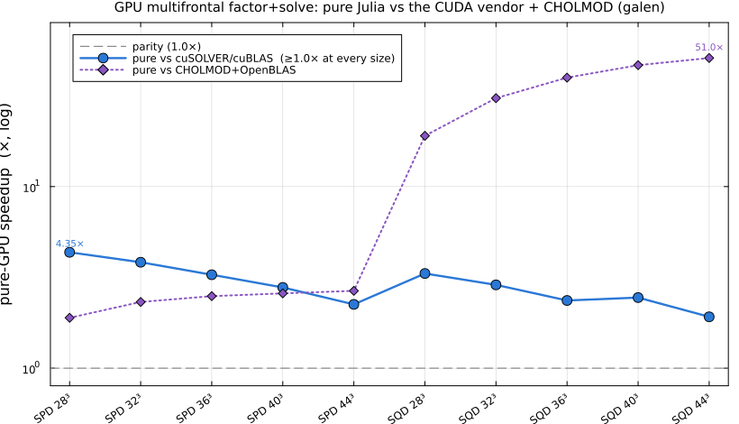
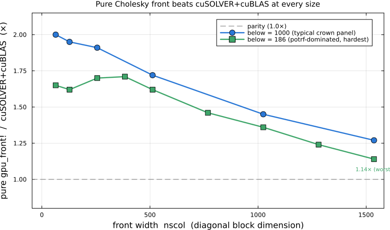

# Benchmarking

## Methodology

`benchmark/gate.jl` runs the M1 wall-time gate: [Chairmarks.jl](https://github.com/LilithHafner/Chairmarks.jl)
medians (not min), single-thread pinned (`BLAS.set_num_threads(1)`), `evals=1` (each
sample is a fresh, independent timed call — appropriate since factorization refactor is
cheap enough per-call that batching isn't needed at the matrix sizes tested), a sample
budget capped at 30 samples / 1.5s per measurement. `benchmark/benchmarks.jl` is a
separate [PkgBenchmark.jl](https://github.com/JuliaCI/PkgBenchmark.jl) suite for
commit-to-commit self-regression (`judge(PureSparse, "HEAD", "base")`) — it answers "did
my change make my code slower?", which the gate does not.

For a methodologically-valid (clock-locked) run, lock CPU frequency first — this repo
doesn't duplicate a locking script; PureBLAS.jl's `bench/fleet_freqlock.sh lock` covers
the same machine. An unlocked run still produces real measured numbers, just noisier.

## Configurations

Three of the design's four configurations (`docs/design.md` §9.3) are measured — the
fourth, CHOLMOD+PureBLAS, is **N/A**, blocked on PureBLAS's documented
`BLAS.lbt_forward`-from-a-live-Julia-process limitation (see PureBLAS.jl's docs):

1. **PureSparse + PureBLAS** (primary) — the actual shipped stack.
2. **PureSparse + OpenBLAS** (kernel-attribution arm) — `benchmark/openblas_backend.jl`
   re-`include`s `src/numeric/llt.jl` verbatim under a different kernel binding (OpenBLAS
   via `LinearAlgebra.LAPACK`/`BLAS` instead of PureBLAS), so this isolates
   PureBLAS-vs-OpenBLAS kernel efficiency from the sparse scheduling layer — no
   algorithm duplication, same source file, different `using`.
3. **CHOLMOD (SparseArrays) + OpenBLAS** (baseline).

Both **own-ordering** (each stack's own AMD) and **same-permutation** (each stack fed the
*other's* chosen permutation via `GivenOrdering`/`perm=`) arms run — the latter isolates
factorization throughput from ordering quality and is part of the gate, not supplementary.

## Current result

As of 2026-07-13 on `neuromancer` (NOT clock-locked — see caveat above), **6/14**
matrix-arm combinations beat CHOLMOD+OpenBLAS on warm numeric refactor. This does **not**
yet meet M1's gate ("strictly faster on at least half the set"). The root cause has been
diagnosed (not guessed — measured): it is not an ordering-quality gap (PureSparse's AMD
fill matches or beats CHOLMOD's on every failing case) but a relaxed-amalgamation
limitation that under-merges supernodes on bushy elimination trees (2D grid Laplacians
being the clearest failing case). See `ROADMAP.md`'s "CURRENT FOCUS" section for the full
table and diagnosis — that file is the living source of truth for gate status; this page
won't be kept in perfect sync with every run.

## Reproducing

```bash
julia --project=benchmark benchmark/gate.jl            # measure + save + print gate verdict
julia --project=benchmark benchmark/gate.jl report      # print verdict from the last saved JSON only
```

Results are written to `benchmark/results/gate_<hostname>.json` (gitignored — per-host
measurement caches aren't committed, matching PureBLAS.jl's convention for its own
per-host benchmark data).

## Sparse QR (M5)

### Methodology

`benchmark/qr_gate.jl` runs the M5 wall-time gate with the same discipline as M1's:
Chairmarks medians, single-thread pinned, `evals=1`, 20 samples / 1.5s per
measurement. Like M1/M2/M4, the gate compares PureSparse's **warm `qr!` refactor**
(the zero-allocation, StrictMode-verified path — the primary "analyze once, factorize
many" API) against SuiteSparseQR's [spqr2011](@cite) factorization. Since stdlib
SuiteSparseQR exposes no analyze-once/refactorize split, its **cold** factorization is
its best case, so the gate is **PureSparse warm `qr!` vs SuiteSparseQR cold** (recorded
as design_qr.md **D13**). This is deterministic on the PureSparse side: the warm path
allocates nothing, so its per-call timing is near-constant (no GC-pause variance).
Both **own-ordering** (PureSparse's COLAMD vs SPQR's default) and **same-permutation**
arms run, as for Cholesky. PureSparse's number is the **best of `:column`/`:frontal`
warm** per matrix-arm — the same choice `qr(A; method = :auto)` makes for a real
caller (`:column` wins the singleton-dominated stratum, `:frontal` the rest).

The gate set is stratified into three regimes (design_qr.md §9.3), and the M5
closeout gate requires **every stratum to pass, both arms** — not just a majority:

- `i_singleton` — LP-shaped, singleton-dominated matrices (`lp_slack`, `staircase`).
- `ii_sparse_R` — genuinely sparse R, little dense work (`banded_ls`, `grid_ls`).
- `iii_flop_rich` — dense-panel-heavy problems where BLAS-3 fronts pay
  (`dense_arrow`, `random_tall`).

Two context arms are measured alongside but are **not** part of the pass/fail
verdict: PureSparse's own `cholesky(AᵀA)` normal equations (the §1.2 "when not to
use QR" alternative) and [faer](@cite)'s sparse QR via a `ccall` shim (its
ordering/threshold choices differ, so gating on it would conflate ordering quality
with kernel throughput).

### Current result

As of 2026-07-16, the M5 closeout gate **PASSES 16/16** — every stratum, both arms —
confirmed on **both** clock-locked hosts (`neuromancer` and `galen`, `performance`
governor). Two-host clock-locked agreement is this project's bar for a gate verdict.
Per stratum:

| Stratum | Passing | Where it stands |
|---|---|---|
| `i_singleton` | **6/6** | warm singleton refactor reuses the pattern-fixed peel set, so the singleton-dominated matrices refactor almost for free on `:column` (e.g. `lp_slack_n800x150` 0.018 ms vs SPQR cold 0.18 ms) |
| `ii_sparse_R` | **6/6** | the multifrontal `:frontal` path wins every sparse-R case (`banded_ls` 0.34 ms vs SPQR 0.93–1.65 ms; `grid_ls_70x50` 5.0 ms vs SPQR 7.6–10.1 ms) |
| `iii_flop_rich` | **4/4** | clean sweep — `:frontal`'s BLAS-3 fronts win every flop-rich case (`random_tall` 8.7 ms vs SPQR 14.4–15.8 ms) |


Two methodology corrections landed with this result and are worth stating plainly.
First, the gate now compares PureSparse's **warm `qr!`** against SPQR cold (D13, above)
rather than cold-vs-cold — matching how M1/M2/M4 already gate, and eliminating the
cold-path GC-pause variance that made single-sample verdicts unreliable. Second, an
earlier round of M5 gate numbers had been timing a **broken** blocked multifrontal
path that silently dropped ~2/3 of columns (so it clocked a fraction of the real
work); that bug is fixed, and the numbers above are the first measured on the corrected
factorization. `ROADMAP.md` is the living source of truth for the full diagnosis trail;
this page won't be kept in perfect sync with every run.

### The flagship dense-panel case (7000×4000)

Where the multifrontal path's BLAS-3 architecture is actually exercised — a
7000×4000 random matrix at 1% and 10% density
(`benchmark/faer_vs_puresparse_7000x4000.jl`) — PureSparse's `:frontal` path is
**tied with [faer](@cite)** and **~30% faster than SuiteSparseQR**, at identical
COLAMD fill (neuromancer, clock-locked, cold factorize-only medians of 10 samples):

| density | PureSparse `:frontal` | faer | SuiteSparseQR | vs faer | vs SPQR |
|---|---|---|---|---|---|
| 1% | **6.47 s** | 6.62 s | 8.25 s | 1.02× | 1.28× |
| 10% | **6.69 s** | 6.93 s | 8.98 s | 1.04× | 1.34× |


!!! warning "Prior flagship numbers withdrawn"
    Earlier versions of this page reported PureSparse `:frontal` at 1.72 s / 0.89 s,
    "2.3–6.5× faster than faer/SPQR". Those numbers were an **artifact of the
    correctness bug** — the broken blocked path dropped columns and timed only a
    fraction of the real work. They are withdrawn; do not cite them. The numbers above
    are the corrected measurement.

Both PureSparse and faer sit near **~13 GFlop/s single-threaded** here, and a
panel-width (NB) sweep confirms that rate is **shape-limited** — the skinny-K trailing
updates of a sparse QR can't reach square-`gemm` peak, which is exactly why all three
implementations cluster near it. Ordering is not the gap either: PureSparse's COLAMD
fill matches SuiteSparse's to within 0.1% (nnz(R) ratio 1.001 at 1%, 1.000 at 10%),
and faer also uses COLAMD. The remaining lever is the PureBLAS dense-`gemm` microkernel
itself, pursued separately.

(The `:column` path takes ~100 s here — this is exactly the regime `method = :auto`
exists to route away from.)

### Reproducing

```bash
julia --project=benchmark benchmark/qr_gate.jl          # measure + save + print gate verdict
julia --project=benchmark benchmark/qr_gate.jl report    # verdict from the last saved JSON only
julia --project=benchmark benchmark/plot_qr_comparison.jl  # regenerate the two plots above
                                                           # from the SAVED JSON (never re-measures)
```

The plots regenerate from `benchmark/results/qr_gate_neuromancer.json` and
`benchmark/results/faer_vs_puresparse_7000x4000_neuromancer.json` — saved measurement
snapshots; re-running a benchmark to make a plot is against this repo's benchmarking
rules (results→JSON first, plots from saved JSON only).

## GPU multifrontal (M6)

The GPU backend (a weak-dependency CUDA extension) factors on the device with a
**multifrontal** supernodal engine: an upward-closed etree frontier splits the small
fronts onto the CPU from the large "crown" fronts on the GPU, and the whole dense inner
loop — the front factorizations *and* the triangular solve — runs through **pure-Julia
KernelAbstractions.jl kernels**. There is no cuSOLVER/cuBLAS on the shipped path (they
remain only as reference/comparison arms). The whole factor stays device-resident, the
solve is device-resident too, and only the right-hand side and solution vectors cross the
bus. Because the kernels are pure KernelAbstractions they are also **portable** — the
entire path compiles, runs, and matches at machine precision on AMD (ROCm) hardware, not
just NVIDIA.

!!! note "Measurement status"
    Numbers are galen (RTX 4070, clock-locked) medians of the **warm, device-resident
    factor+solve** — near-deterministic, so the honest viz is a median line/bar (a violin
    would be a flat line — same reasoning as the QR gate figure above). The gate
    (`docs/design_gpu.md` §8) times **factor + solve**, both on device.

### The gate: pure Julia vs the CUDA vendor libraries and CHOLMOD

The design target is that the pure kernels are **≥ 1.0× the CUDA vendor equivalent**
(cuSOLVER/cuBLAS) and beat CHOLMOD+OpenBLAS, on a large SPD + SQD stratum. Both hold at
every size — measured as **one clean run** with a vendor GPU arm (same multifrontal
structure, dense front ops + solve swapped to cuSOLVER/cuBLAS):



| stratum | pure vs cuSOLVER/cuBLAS | pure vs CHOLMOD |
|---|---|---|
| SPD grids 28³–44³ | 4.35× → 2.25× | 1.9× → parity⁺ |
| SQD KKTs 28³–44³ (interior-point) | 3.32× → 1.92× | **8× → 51×** |

**Pure-GPU factor+solve beats the cuSOLVER/cuBLAS equivalent at all 10 stratum points**
(worst margin 1.92× at the 87k-DOF KKT), and beats CHOLMOD everywhere — up to **51×** on
the KKT/interior-point workload PureSparse is built for (CHOLMOD's sparse `ldlt` is genuinely
slow there). The vendor arm was verified correct-to-correct (residual ≤ 8.6e-16).

### Cholesky at every front size

Cholesky is the load-bearing operation, and the requirement is strict: the pure front must
beat cuSOLVER+cuBLAS at *every* supernode width, not just on average. It does — the fused
register-resident front (`_front_fused64_v3!`, one right-looking sweep driving the factor
and the panel solve together) clears parity from `nscol` 64 to 1536, on both the typical
crown panels and the hardest potrf-dominated fronts (tiny below-panel), worst case 1.14×:



### The triangular solve

The device solve is **level-scheduled and batched**: elimination-tree levels are computed
once at symbolic time (independent supernodes per level), and each level is one batched
pure-KA kernel launch instead of thousands of tiny per-supernode `trsv`/`gemv` calls. That
turned a launch-bound sweep (≈63 000 launches, as slow as the factor) into ≈67 launches —
a **21× speedup** on a 44³ KKT — which is what makes the end-to-end factor+solve track the
factor's advantage rather than being throttled by the solve.

### Memory: the bounded arena

The multifrontal update matrices live in a **bounded stack-with-compaction arena** (each
front builds its Schur complement in a work slot, then compacts it onto a stack over the
space its children freed), rather than a monotonic per-front allocation. That is the
difference between OOM and fit on the large KKTs — **5.9× smaller at 44³**, and the ratio
grows with problem size:


### Reproducing

```bash
julia --project=gpu_probe  benchmark/gpu_gate.jl            # the §8 gate (needs a GPU) → JSON
julia --project=benchmark  benchmark/plot_gpu_comparison.jl # regenerate the plots from SAVED JSON
```

The figures regenerate from the saved measurement snapshots
`benchmark/results/gpu_gate_galen.json` (the §8 gate: pure / vendor / CHOLMOD),
`gpu_chol_sweep_galen.json` (the Cholesky-front sweep), and `gpu_multifrontal_galen.json`
(arena) — never from a live benchmark, per this page's rule. The correctness oracles that
back these numbers (device factor matches CPU factor at machine precision, exact inertia,
solve residuals) live in `benchmark/gpu/`; the AMD-portability check is
`benchmark/gpu/amd_kernel_test.jl`.
