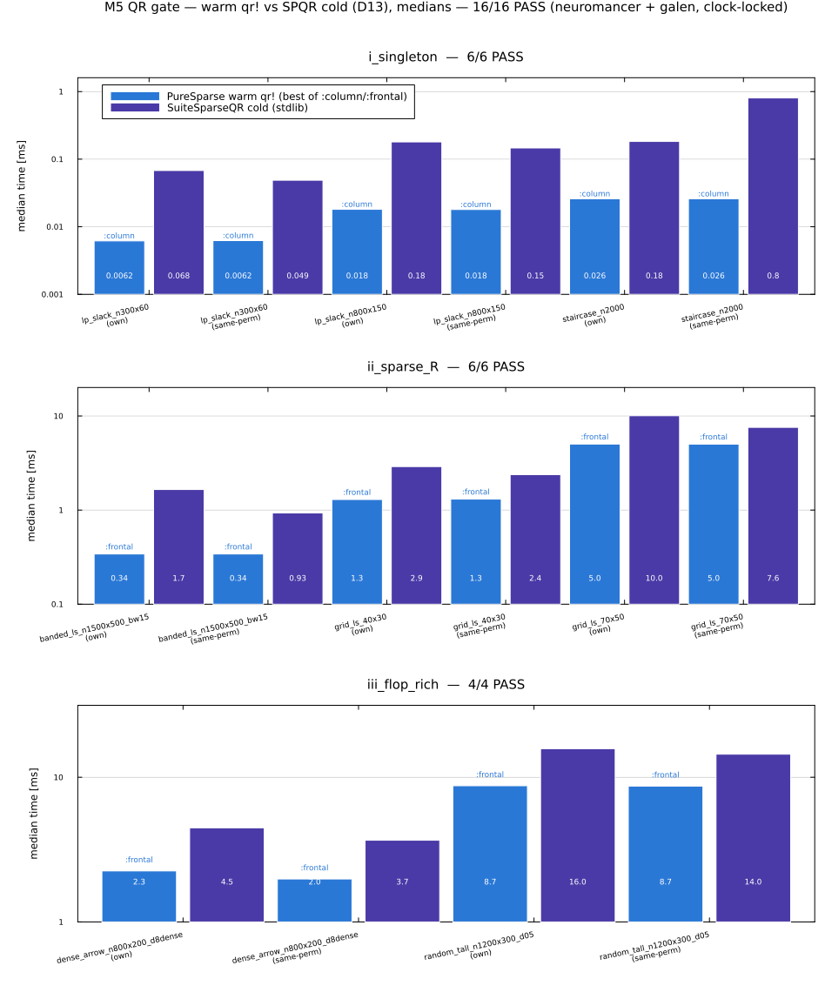
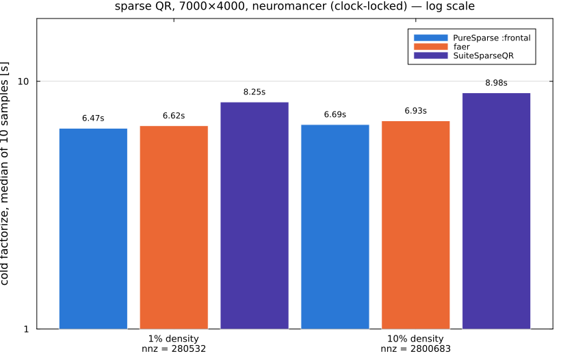

# Benchmarking

## Methodology

`benchmark/gate.jl` runs the M1 wall-time gate: [Chairmarks.jl](https://github.com/LilithHafner/Chairmarks.jl)
medians (not min), single-thread pinned (`BLAS.set_num_threads(1)`), `evals=1` (each
sample is a fresh, independent timed call — appropriate since factorization refactor is
cheap enough per-call that batching isn't needed at the matrix sizes tested), a sample
budget capped at 30 samples / 1.5s per measurement. `benchmark/benchmarks.jl` is a
separate [PkgBenchmark.jl](https://github.com/JuliaCI/PkgBenchmark.jl) suite for
commit-to-commit self-regression (`judge(PureSparse, "HEAD", "base")`) — it answers "did
my change make my code slower?", which the gate does not.

For a methodologically-valid (clock-locked) run, lock CPU frequency first — this repo
doesn't duplicate a locking script; PureBLAS.jl's `bench/fleet_freqlock.sh lock` covers
the same machine. An unlocked run still produces real measured numbers, just noisier.

## Configurations

Three of the design's four configurations (`docs/design.md` §9.3) are measured — the
fourth, CHOLMOD+PureBLAS, is **N/A**, blocked on PureBLAS's documented
`BLAS.lbt_forward`-from-a-live-Julia-process limitation (see PureBLAS.jl's docs):

1. **PureSparse + PureBLAS** (primary) — the actual shipped stack.
2. **PureSparse + OpenBLAS** (kernel-attribution arm) — `benchmark/openblas_backend.jl`
   re-`include`s `src/numeric/llt.jl` verbatim under a different kernel binding (OpenBLAS
   via `LinearAlgebra.LAPACK`/`BLAS` instead of PureBLAS), so this isolates
   PureBLAS-vs-OpenBLAS kernel efficiency from the sparse scheduling layer — no
   algorithm duplication, same source file, different `using`.
3. **CHOLMOD (SparseArrays) + OpenBLAS** (baseline).

Both **own-ordering** (each stack's own AMD) and **same-permutation** (each stack fed the
*other's* chosen permutation via `GivenOrdering`/`perm=`) arms run — the latter isolates
factorization throughput from ordering quality and is part of the gate, not supplementary.

## Current result

As of 2026-07-13 on `neuromancer` (NOT clock-locked — see caveat above), **6/14**
matrix-arm combinations beat CHOLMOD+OpenBLAS on warm numeric refactor. This does **not**
yet meet M1's gate ("strictly faster on at least half the set"). The root cause has been
diagnosed (not guessed — measured): it is not an ordering-quality gap (PureSparse's AMD
fill matches or beats CHOLMOD's on every failing case) but a relaxed-amalgamation
limitation that under-merges supernodes on bushy elimination trees (2D grid Laplacians
being the clearest failing case). See `ROADMAP.md`'s "CURRENT FOCUS" section for the full
table and diagnosis — that file is the living source of truth for gate status; this page
won't be kept in perfect sync with every run.

## Reproducing

```bash
julia --project=benchmark benchmark/gate.jl            # measure + save + print gate verdict
julia --project=benchmark benchmark/gate.jl report      # print verdict from the last saved JSON only
```

Results are written to `benchmark/results/gate_<hostname>.json` (gitignored — per-host
measurement caches aren't committed, matching PureBLAS.jl's convention for its own
per-host benchmark data).

## Sparse QR (M5)

### Methodology

`benchmark/qr_gate.jl` runs the M5 wall-time gate with the same discipline as M1's:
Chairmarks medians, single-thread pinned, `evals=1`, 20 samples / 1.5s per
measurement. The gate is **cold-vs-cold only** — one-shot `qr(A)` including symbolic
analysis — because stdlib SuiteSparseQR [spqr2011](@cite) exposes no
analyze-once/refactorize path to compare warm `qr!` against (warm numbers are
reported in the JSON, not gated). Both **own-ordering** (PureSparse's COLAMD vs
SPQR's default) and **same-permutation** arms run, as for Cholesky. PureSparse's
number is the **best of `:column`/`:frontal`** per matrix-arm — the same choice
`qr(A; method = :auto)` makes for a real caller.

The gate set is stratified into three regimes (design_qr.md §9.3), and the M5
closeout gate requires **every stratum to pass, both arms** — not just a majority:

- `i_singleton` — LP-shaped, singleton-dominated matrices (`lp_slack`, `staircase`).
- `ii_sparse_R` — genuinely sparse R, little dense work (`banded_ls`, `grid_ls`).
- `iii_flop_rich` — dense-panel-heavy problems where BLAS-3 fronts pay
  (`dense_arrow`, `random_tall`).

Two context arms are measured alongside but are **not** part of the pass/fail
verdict: PureSparse's own `cholesky(AᵀA)` normal equations (the §1.2 "when not to
use QR" alternative) and [faer](@cite)'s sparse QR via a `ccall` shim (its
ordering/threshold choices differ, so gating on it would conflate ordering quality
with kernel throughput).

### Current result

As of 2026-07-15 on `galen` (clock-locked, `performance` governor), **6/16**
matrix-arm combinations beat SuiteSparseQR cold. This does **not** yet meet M5's
gate. Per stratum:

| Stratum | Passing | Where it stands |
|---|---|---|
| `iii_flop_rich` | **4/4** | clean sweep — the multifrontal path (M5b) wins every flop-rich case, by up to ~2.5× |
| `i_singleton` | 2/6 | losses are noise-level margins (~0.04–0.15 ms either way); `:auto` already routes these to `:column`, and the residual gap is fixed per-call setup overhead, not an algorithmic deficit |
| `ii_sparse_R` | 0/6 | the real open front: SPQR stays ~1.1–2.3× ahead on sparse-R problems (`banded_ls` own-arm ≈ 2.2× is the worst); `grid_ls_70x50`'s single-sample gate readings additionally have high measured sample-to-sample variance, so no single verdict there is trusted without a longer run |



`ROADMAP.md` is the living source of truth for the diagnosis trail (amalgamation
retuning tested and ruled out; panel-split trigger bug found and fixed — that fix is
what closed `iii_flop_rich`; scalar small-front fallback landed); this page won't be
kept in perfect sync with every run.

### The flagship dense-panel case (7000×4000)

Where the multifrontal path's BLAS-3 architecture is actually exercised — a
7000×4000 random matrix at 1% and 10% density
(`benchmark/faer_vs_puresparse_7000x4000.jl`) — PureSparse's `:frontal` path beats
both [faer](@cite) and SuiteSparseQR outright (galen, clock-locked, cold medians of
10 samples; four runs across two comparator implementations now agree within ~1%):

| density | PureSparse `:frontal` | faer | SuiteSparseQR | vs faer | vs SPQR |
|---|---|---|---|---|---|
| 1% | **1.72 s** | 4.00 s | 5.23 s | 2.3× | 3.0× |
| 10% | **0.89 s** | 4.23 s | 5.74 s | 4.8× | 6.5× |



**Comparator fairness check (2026-07-15):** the [faer](@cite) side originally timed
factorize *and* a least-squares solve together (the Rust FFI comparator shim needed a
solve as a compiler dead-code-elimination guard, since faer's sparse `Qr` exposes no
direct `.R()` accessor) — not a fair comparison against PureSparse's/SPQR's
factorize-only wrappers. Fixed by adding a factorize-only variant
(`std::hint::black_box` as the guard instead) and re-measuring: the corrected numbers
above are within ~0.7% of the pre-fix ones, confirming the solve was cheap relative
to the factorization and the original margin wasn't a measurement artifact — but the
fix is real and the comparator now measures the same thing on both sides.

(The `:column` path takes ~60 s here — this is exactly the regime `method = :auto`
exists to route away from.) The honest overall picture: PureSparse QR is already the
fastest of the three at the large, flop-rich end, and not yet competitive with SPQR
on small singleton-heavy and sparse-R problems — which is why the gate stays open.

### Reproducing

```bash
julia --project=benchmark benchmark/qr_gate.jl          # measure + save + print gate verdict
julia --project=benchmark benchmark/qr_gate.jl report    # verdict from the last saved JSON only
julia --project=benchmark benchmark/plot_qr_comparison.jl  # regenerate the two plots above
                                                           # from the SAVED JSON (never re-measures)
```

The plots regenerate from `benchmark/results/qr_gate_galen.json` and
`benchmark/results/faer_vs_puresparse_7000x4000_galen.json` — saved measurement
snapshots; re-running a benchmark to make a plot is against this repo's benchmarking
rules (results→JSON first, plots from saved JSON only).
